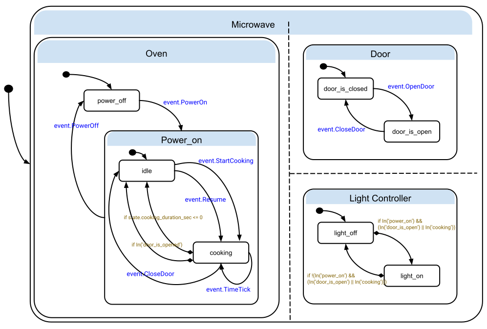

# C++ StateChart Library

StateCharts [(Harel, 1987)](ref1) is a visual formalism for declarative
description of complex interactive systems.
It extends the conventional state machine formalism with Hierarchy, Concurrency
and Communication.

[SCXML](https://www.w3.org/TR/scxml/) is a W3C standard based on StaeCharts.
This is a C++ library that implements the SCXML specification. Instead of XML, a
StateChart is represented as a StateChart protobuf.

# Features
Many features from the SCXML standard have been implemented.

* Composite State
* Parallel State
* Datamodel
* Transitions (Conditional, Eventless)
* Executable Statements (Raise, Log, Assign, If, ForEach, Send)
* Serialize/Deserialize the state machine

# TODO

* History

# Example
Here's an example of a StateChart that describes a Microwave.



You can see [//statechart/example/microwave_example_main.cc](statechart/example/microwave_example_main.cc)
for details on how to specify such a StateChart as a StateChart proto and how to use it in code.

# Usage

To build the library you'll need bazel. You can download and install it from [here](https://www.bazel.build/).

```
# Download/Clone the repo.
git clone https://github.com/google/statechart.git
cd statechart

# Build the library
bazel build //statechart/...

# Run unit tests
bazel test //statechart/...

# Run the Microwave example
bazel run //statechart/example:microwave_example_main -- --alsologtostderr
```

# Disclaimer
This is not an officially supported Google product.

# References

* David Harel, 1987, Statecharts: a visual formalism for complex systems,
Science of Computer Programming.
[Link](https://www.sciencedirect.com/science/article/pii/0167642387900359)
* State Chart XML (SCXML): State Machine Notation for Control Abstraction.
[Link](https://www.w3.org/TR/scxml/)
